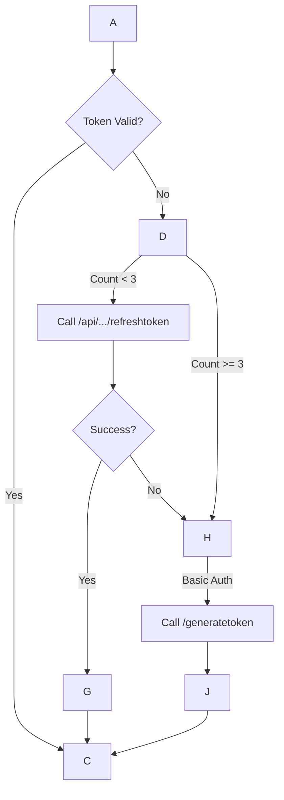

This is a strategic pivot. Starting with a **Read-Only MVP (Minimum Viable Product)** is the correct engineering approach. It isolates the most fragile components—Authentication, Rate Limiting, and Pagination—without the risk of accidentally breaking network configurations.

Below is the **Technical Design Document** for the Read-Only FMC MCP Server. I have incorporated the specific feedback you provided, particularly regarding connection concurrency and the specific limits of the bulk/pagination APIs.

### **Technical Design Document: Cisco FMC Read-Only MCP Server (MVP)**

#### **1. MVP Objectives & Scope**

* **Goal:** Establish a stable, self-healing connection to FMC and expose network configuration context to the LLM.
* **Scope:** **READ-ONLY**. No configuration changes (`POST`, `PUT`, `DELETE` are disabled).
* **Success Criteria:**
    1. Server authenticates and stays connected for \>2 hours (handling the 3-refresh hard stop).
    2. Respects the 120 req/min AND **10 concurrent connection** limits.
    3. Successfully pages through \>1,000 network objects without timing out.
    4. Exposes devices and objects as MCP Resources.

-----

#### **2. Revised Constraints & Resiliency Strategy**

Based on the feedback, we are refining the transport layer constraints.

| Constraint | Value | Architectural Solution |
| :--- | :--- | :--- |
| **Rate Limit** | 120 req/min | Token Bucket Limiter (Capacity: 120, Refill: 2/sec). |
| **Concurrency** | **10 connections** | \*\*\*\* `httpx.Limits(max_connections=10)` to prevent socket exhaustion. |
| **Token Life** | 30 mins | Auto-refresh on `401 Unauthorized`. |
| **Hard Stop** | 3 Refreshes | \*\*\*\* Force full re-login (Basic Auth) after 3 refreshes. |
| **Payload** | \~2MB (Bulk) | *Not applicable for Read-Only writes*, but relevant for large JSON responses. |
| **Pagination** | Max 1000 items | Recursive fetch logic using `offset` and `limit`. |

-----

#### **3. Authentication & Transport Architecture**

This is the "Engine Room" of the server. It must be decoupled from the MCP logic.

**Component:** `FMCClient` (Singleton)
**Library:** `httpx` (Async)

**The "Hard Stop" Handling Logic:**
The standard OAuth "refresh loop" is insufficient here. We implement a **Generational Session Manager**.



**Configuration Implementation (Python):**

```python
import httpx

# Enforcing the 10-connection limit from feedback
limits = httpx.Limits(max_keepalive_connections=5, max_connections=10)

client = httpx.AsyncClient(
    base_url=f"https://{FMC_HOST}",
    verify=SSL_VERIFY,
    limits=limits,  # Critical fix based on feedback
    timeout=60.0    # Increased timeout for large paginated reads
)
```

-----

#### **4. MCP Resource Mapping (Read-Only)**

We will strictly use **Resources** for fetching lists and configurations. This allows the LLM to "read" the firewall config like a file.

**URI Scheme:** `fmc://{domain_name}/{resource_type}/{identifier}`

| Resource URI | Description | FMC API Endpoint | Why? |
| :--- | :--- | :--- | :--- |
| `fmc://system/info` | Server version & health | `/api/fmc_platform/v1/info/serverversion` | "Hello World" sanity check. |
| `fmc://devices/list` | Summary of all firewalls | `/api/fmc_config/v1/domain/{uuid}/devices/devicerecords` | Context grounding. |
| `fmc://device/{name}/interfaces` | Interface IPs & Status | `.../devices/devicerecords/{uuid}/physicalinterfaces` | Troubleshooting context. |
| `fmc://objects/network` | **ALL** Network Objects | `/api/fmc_config/v1/domain/{uuid}/object/networks` | The "Phonebook" of the network. |
| `fmc://objects/ports` | **ALL** Port Objects | `/api/fmc_config/v1/domain/{uuid}/object/ports` | Service definitions. |

**The Pagination Problem (Feedback Integration):**
The feedback correctly noted that simple GETs fail on large datasets. The `objects/network` resource must implement **transparent pagination**.

**Logic for `fmc://objects/network`:**

1. Resource handler is called.
2. `FMCClient` calls API with `limit=1000&offset=0`.
3. If `paging.pages > 1`, `FMCClient` enters a `while` loop.
4. Increment offset by 1000.
5. Accumulate results.
6. Return **one merged JSON blob** to the LLM.
      * *Note:* If the dataset is huge (\>5MB), we may need to truncate or summarize, but for an MVP, fetching all is the best stress test.

-----

#### **5. MCP Tools (Read-Only Queries)**

While Resources are passive, Tools allow specific lookups. We will implement **two** tools to verify the "Search" capability without writing changes.

1. **`search_object_by_ip`**

      * **Goal:** "What object is 10.10.10.5?"
      * **Logic:** Fetches network objects (cached if possible) and filters Python-side (since FMC API filtering is limited) or uses the `?filter=value:10.10.10.5` query param if supported by the specific version.

2. **`get_deployment_status`**

      * **Goal:** "Is the firewall syncing?"
      * **Logic:** Queries `/api/fmc_config/v1/domain/{uuid}/deployment/deployabledevices`. Useful to see if the device is dirty (needs deployment).

-----

#### **6. Project Structure (MVP)**

We will keep the structure flat and simple for the MVP.

fmc-mcp-read-only/
├──.env                    \# Credentials (Host, User, Pass)
├── pyproject.toml          \# Deps: mcp, httpx, pydantic, python-dotenv
├── src/
│   ├── **init**.py
│   ├── main.py             \# Entry point, MCP Server definition
│   ├── config.py           \# Env loading & Validation
│   ├── fmc.py              \# FMCClient class (Auth, RateLimit, Pagination)
│   └── utils.py            \# JSON formatting helpers
└── README.md

-----

#### **7. Implementation Plan (Step-by-Step)**

**Step 1: The Skeleton (Transport)**

* Create `fmc.py`.
* Implement `connect()` using `httpx`.
* Implement `_authenticate()` with the `generatetoken` endpoint.
* **Test:** Run a script that authenticates and prints the Token UUID.

**Step 2: The "Keep-Alive" Logic**

* Add the `refreshtoken` logic.
* Write a loop that makes a call every 10 seconds for 10 minutes to verify token stability.

**Step 3: The First Resource (System Info)**

* Setup `FastMCP` in `main.py`.
* Expose `fmc://system/info`.
* **Test:** Use **Claude Desktop** or **MCP Inspector** to read the resource.

**Step 4: The Heavy Lift (Pagination)**

* Implement `get_objects(type='networks')` in `fmc.py`.
* Add the logic to loop `offset += 1000` until `items` is empty.
* Expose `fmc://objects/network`.
* **Test:** Ensure it returns *all* objects, not just the first 25.

**Step 5: Security & Cleanup**

* Add the `FMC_VERIFY_SSL=False` warning logger.
* Ensure the session closes cleanly on exit.

### **Refined Code Snippet: The Pagination Logic**

This specific piece of code addresses the pagination feedback directly.

```python
# src/fmc.py

async def get_all_items(self, endpoint: str):
    """
    Transparently handles pagination for FMC APIs.
    Fetches 1000 items at a time (bulk read limit).
    """
    all_items =
    limit = 1000
    offset = 0
    
    while True:
        # Construct URL with pagination params
        # Note: 'expanded=true' gives us the details we need for context
        params = {"limit": limit, "offset": offset, "expanded": "true"}
        
        response = await self.client.get(endpoint, params=params)
        response.raise_for_status()
        data = response.json()
        
        items = data.get("items",)
        if not items:
            break
            
        all_items.extend(items)
        
        # Check if we have reached the end
        paging = data.get("paging", {})
        if offset + limit >= paging.get("count", 0):
            break
            
        offset += limit
        
    return all_items
```

This design provides a simplified, highly robust foundation. Once this MVP is working, adding "Write" capabilities is simply a matter of adding new Tools that utilize this existing, stable connection layer.
